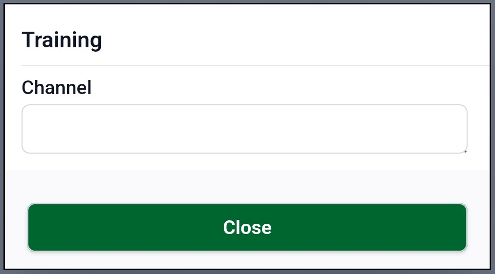
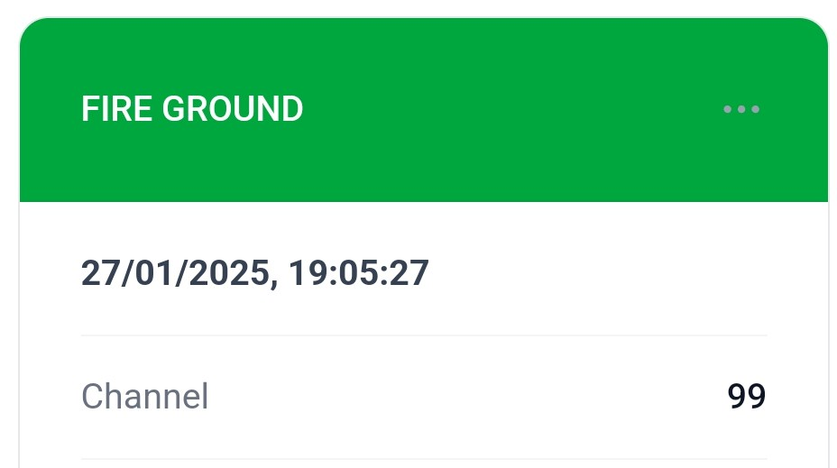

# Fire Note: A Reliable Tool for Firefighters

The primary goal of **Fire Note** is to provide firefighters with a dedicated tool for logging and recalling notes related to firefighting or associated activities. While it will never replace the reliability of pen and paper—since no technology is entirely failproof—it serves as a valuable companion to enhance and simplify the recording of crucial information during firefighting operations.

Let’s face it—how often have you scribbled down important notes, only to revisit them later and wonder if someone else (or perhaps your sleep-deprived self) wrote them? Fire Note helps eliminate that confusion by organizing and preserving your notes in a clear, structured, and easily retrievable way.

### Key Features of Fire Note

1. **Activity Recording at Fire Scenes**
   Easily log activities, observations, and decisions during a fire scene, ensuring that critical details are preserved and accessible when needed.
2. **Offline Functionality**
   Fire Note works entirely offline, requiring no internet connection. This makes it a dependable tool even in remote locations or disaster areas with poor connectivity.
3. **Real-Time Grid Reference**
   Instantly access a six-grid reference with your current heading. The app also supports resection functionality, aiding in precise location tracking to help you orient yourself quickly and accurately.
4. **Nearest Address Display**
   If an internet connection is available, Fire Note will display the nearest address based on your current location, offering additional context when reporting or reviewing incident details.
5. **Location and Heading Recording**
   Automatically capture and log your current location, heading, direction, and the last known address. This feature ensures that essential location data is always recorded for future reference.

Fire Note bridges the gap between traditional methods and modern technology, making note-taking smarter and more efficient for firefighters. Whether you’re in the middle of a chaotic fire scene or documenting your post-incident observations, Fire Note keeps everything organized and at your fingertips.

> [!IMPORTANT]
>
> The app and documentation is still in Alpha and will continue to be updated.

## Initial Screen

1. 6 Digit Reference
2. Heading 
3. Resection Heading
4. Home
5. Add new incident

## Adding a note

Once you have created an incident then you will be present with additional options:

1. Home
2. Title
3. Add Note
4. Information (information about Radios and other important information)

To add a new note, click on the Plus Icon (3) and you will be present with the following:

You will be presented with multiple categories (above is just an example), in the above you will see "Communication", in this category you will see additional options such as Fire Ground.

Each category will have different set of inputs, for example, Fire Ground will ask for the channel for the fire ground. 

You will also see the following note been added to the list of notes:

